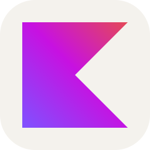

 

<table width="100%">
<tr>

<td width="60%" align="left">

<b>📌 Quick Info</b>

  

🇦🇷 <b>Córdoba, Argentina</b> 
🎂 <b>24 years old</b> 
🗣️ <b>Spanish · English (Intermediate)</b> 
🌎 <b>Open to Remote Opportunities</b> 
📚 <b>4th Year Student</b> 
🐧 <b>Linux User</b>

</td>

<td width="40%" align="center">

</td>

</tr>
</table>

 

---

## 👨🏻‍💻 About Me

<table width="100%">
<tr>

<td width="75%" align="left">

I'm **Santiago Javier Sánchez**, a Full Stack Developer and Computer Engineering student from **Córdoba, Argentina**.

I'm passionate about building real-world applications, solving problems through software, and continuously learning new technologies. My main focus is **backend and full-stack development**, while I also enjoy working across the entire development process, from designing APIs and databases to building user interfaces.

I have hands-on experience through personal and academic projects involving **web applications, REST APIs, databases, automation, and AI integrations**. I'm particularly interested in creating practical solutions that improve processes and turn ideas into working software.

 

🎓 **Computer Engineering Student** 
💻 **Full Stack & Backend Development** 
🤖 **Automation & AI Integrations** 
🧠 **Always learning and exploring** 
🚀 **Always building**

</td>

<td width="25%" align="center">

</td>

</tr>
</table>

---

## 🖥️ Terminal

<pre>
╭──────────────────────────────────────────────────────────╮
│                                                          │
│  santiago@github:~$ whoami                               │
│                                                          │
│  Santiago Javier Sánchez                                 │
│                                                          │
│  → Full Stack Developer                                  │
│  → Computer Engineering Student                          │
│  → Backend & Web Developer                               │
│                                                          │
│  santiago@github:~$ cat focus.txt                        │
│                                                          │
│  > Backend Development                                   │
│  > Full Stack Applications                               │
│  > REST APIs                                             │
│  > Databases                                             │
│  > Automation                                            │
│  > Artificial Intelligence                               │
│                                                          │
│  santiago@github:~$ echo $STATUS                         │
│                                                          │
│  Always learning. Always building. 🚀                    │
│                                                          │
╰──────────────────────────────────────────────────────────╯
</pre>

---

## 🛠️ Tech Stack

### 💻 Languages

  

### 🎨 Frontend

  

### ⚙️ Backend & Runtime

  

### 🗄️ Databases

  

### 📱 Mobile Development

  

### 🎮 Game Development

  

### 🧊 3D Development

  

### 🔧 Tools & Environment

---

## 🚀 What I Build

<table width="100%">
<tr>

<td width="50%" valign="top">

### 🔐 Backend & APIs

REST APIs, authentication, authorization, databases and backend architectures.

</td>

<td width="50%" valign="top">

### 🌐 Full Stack Applications

Complete applications connecting frontend, backend, databases and external services.

</td>

</tr>

<tr>

<td width="50%" valign="top">

### ⚡ Automation

Tools and workflows designed to simplify repetitive processes and improve productivity.

</td>

<td width="50%" valign="top">

### 🤖 AI Integrations

Applications and workflows that integrate AI to provide useful functionality and automation.

</td>

</tr>
</table>

---

## 🚀 Featured Projects

<table width="100%">
<tr>

<td width="50%" valign="top">

### 🔐 System Back Office

A full-stack management platform focused on operations, authentication, roles, reporting and business processes.

**Node.js · Express · PostgreSQL · React · TypeScript**

</td>

<td width="50%" valign="top">

### 📄 CVisto

A job-search management platform designed to organize applications, companies, contacts, emails and recruitment processes.

**Node.js · React · PostgreSQL · Google APIs · AI**

</td>

</tr>

<tr>

<td width="50%" valign="top">

### 🚗 Vehicle Marketplace

A full-stack marketplace for buying and selling vehicles with authentication, roles, listings and database management.

**NestJS · Prisma · PostgreSQL · React**

</td>

<td width="50%" valign="top">

### 🛒 SUPER AHORRO

An Android application focused on grocery planning, budgets, products, purchases, offers and useful shopping tools.

**Kotlin · Jetpack Compose · Room · Retrofit**

</td>

</tr>
</table>

---

## 📬 Contact Me

 

<b>sanchez242018@gmail.com</b>

  

---

