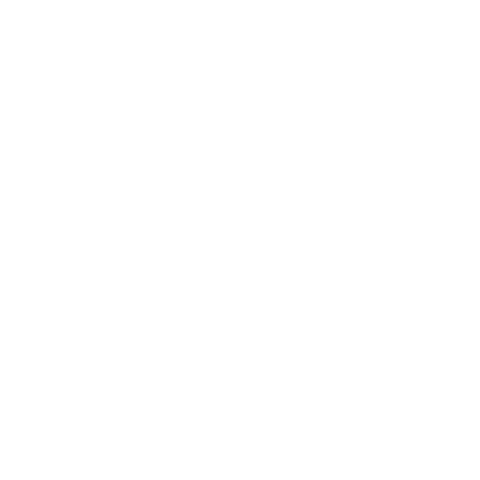
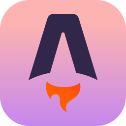
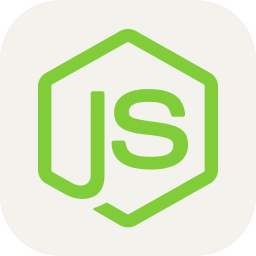

<div align="center">
    


<br/>


<p align="center">
  <a href="https://github.com/DenverCoder1/readme-typing-svg"></a>
</p>
<p>
  🇦🇷 Córdoba, Argentina
</p>


</div>

---

## 👨🏻‍💻 About Me

<table width="100%">
<tr>

<td width="75%" align="left" valign="top">

I'm **Santiago Javier Sánchez**, a Full Stack Developer and Computer Engineering student from **Córdoba, Argentina**.

I'm passionate about building real-world applications, solving problems through software, and continuously learning new technologies. My main focus is **backend and full-stack development**, while I also enjoy working across the entire development process, from designing APIs and databases to building user interfaces.

I have hands-on experience through personal and academic projects involving **web applications, REST APIs, databases, automation, and AI integrations**. I'm particularly interested in creating practical solutions that improve processes and turn ideas into working software.

<br/>

🎓 **Computer Engineering Student**<br/>
💻 **Full Stack &amp; Backend Development**<br/>
🤖 **Automation &amp; AI Integrations**<br/>
🧠 **Always learning and exploring**<br/>
🚀 **Always building**

</td>

<td width="25%" align="right" valign="middle">



</td>

</tr>
</table>

---

## 🖥️ Terminal

<div align="center">

```text
╭──────────────────────────────────────────────────────────╮
│                                                          │
│  santiago@github:~$ whoami                               │
│                                                          │
│  Santiago Javier Sánchez                                 │
│                                                          │
│  → Full Stack Developer                                  │
│  → Computer Engineering Student                          │
│  → Backend & Web Developer                               │
│                                                          │
│  santiago@github:~$ cat focus.txt                        │
│                                                          │
│  > Backend Development                                   │
│  > Full Stack Applications                               │
│  > REST APIs                                             │
│  > Databases                                             │
│  > Automation                                            │
│  > Artificial Intelligence                               │
│                                                          │
│  santiago@github:~$ echo $STATUS                         │
│                                                          │
│  Always learning. Always building. 🚀                    │
│                                                          │
╰──────────────────────────────────────────────────────────╯
```
</div>

---

<div align="center">

<h2>Tech Stacks</h2><br><br>
</div>
<div align="left">

### 💻 Languages

<a href="https://www.java.com"></a>
<a href="https://kotlinlang.org"></a>
<a href="https://developer.mozilla.org/docs/Web/JavaScript"></a>
<a href="https://www.typescriptlang.org"></a>
<a href="https://isocpp.org"></a>
<a href="https://www.rust-lang.org"></a>
<a href="https://developer.mozilla.org/docs/Web/HTML"></a>
<a href="https://developer.mozilla.org/docs/Web/CSS"></a>

### 🎨 Frontend

<a href="https://react.dev"></a>
<a href="https://astro.build"></a>
<a href="https://tailwindcss.com"></a>

### ⚙️ Backend & Runtime

<a href="https://nodejs.org"></a>
<a href="https://bun.sh"></a>
<a href="https://deno.com"></a>

### 🗄️ Databases

<a href="https://www.mysql.com"></a>
<a href="https://www.postgresql.org"></a>
<a href="https://www.sqlite.org"></a>

### 📱 Mobile

<a href="https://kotlinlang.org"></a>
<a href="https://developer.android.com/studio"></a>

### 🔧 Tools & Environment

<a href="https://git-scm.com"></a>
<a href="https://www.docker.com"></a>
<a href="https://www.linux.org"></a>
<a href="https://www.postman.com"></a>
<a href="https://www.figma.com"></a>

</div>

---

## 🚀 What I Build

<div align="center">

<table>
<tr>

<td width="50%" valign="top">

### 🔐 Backend & APIs

REST APIs, authentication, authorization, databases and backend architectures.

</td>

<td width="50%" valign="top">

### 🌐 Full Stack Applications

Complete applications connecting frontend, backend, databases and external services.

</td>

</tr>

<tr>

<td width="50%" valign="top">

### ⚡ Automation

Tools and workflows designed to simplify repetitive processes and improve productivity.

</td>

<td width="50%" valign="top">

### 🤖 AI Integrations

Applications and workflows that integrate AI to provide useful functionality and automation.

</td>

</tr>
</table>

</div>

---

## 📬 Contáctame

<div align="center">
<a href="mailto:sanchez242018@gmail.com"></a>
<br/>
<b>sanchez242018@gmail.com</b>
<br/><br/>
<a href="https://github.com/Sanchez-Santiago"></a>
<a href="https://www.linkedin.com/in/santiago-sanchez-dev/"></a>
<a href="https://discord.com/users/708152038961184779"></a>
<a href="https://www.instagram.com/santiago_sanchez.24/"></a>
<a href="https://portafolio-santiago-sanchez.netlify.app"></a>
</div>


---


